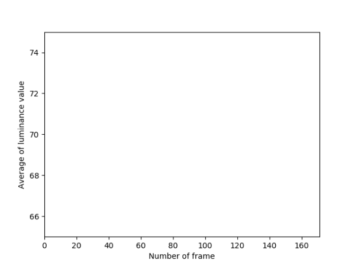

1. プログラムとその説明

- コード
```py
import numpy as np
import cv2
import os
from PIL import Image
import matplotlib.pyplot as plt

ave=[]
j=0

cap = cv2.VideoCapture('digital.mp4')   #動画ファイル読込準備

dir_name = "screen_caps"
if not os.path.exists(dir_name):
    os.mkdir(dir_name)

frame_count = int(cap.get(7))
for i in range(frame_count):
    ret, frame = cap.read()   #動画ファイルのframe読込
    cv2.imwrite(dir_name+ "/" + str(i) + ".png", frame)
    gray = cv2.imread('screen_caps/{}.png'.format(i), 0)  #frameをgray画像に変換
    ave = np.append(ave, np.mean(gray))
    plt.plot(np.arange(i+1), ave)
    plt.xlabel('Number of frame')
    plt.ylabel('Average of luminance value')
    plt.xlim(0, frame_count)
    plt.ylim(65, 75)
    im="im{}.png".format(i)
    plt.savefig(im)
    plt.clf()
plt.plot(np.arange(frame_count), ave)
```

- プログラムの説明  
   1. cv2, os, numpy, PIL, matplotlib.pyplotを読み込む
   2. カレントディレクトリ内にある、動画ファイルdigital.mp4を読み込む
   3. カレントディレクトリに"screen_caps"ディレクトリがなければディレクトリを作成する
   4. フレーム総数回、フレームを読み込み、名前を付けてpng形式でscreen_capsディレクトリに書き込む
   5. 書き込まれた画像ファイルをグレースケールでよ読み込み、それぞれの輝度値の平均を計算・プロットする
   6. 番号順に、名前を付けて出力された画像を保存し、メモリを過剰に使うのを防ぐために、グラフをクリアして再利用する
   7. 最後に、すべてのフレームにおける、輝度値の平均のプロット結果を表示する

1. 使い方，実行の仕方，依存ライブラリとバージョン

    - 使い方・実行の仕方
        - digital.ipynbダウンロードし、jupyter notebookを起動。ctrl+Enterでコードを実行(カレントディレクトリにあらかじめファイル名"digital.mp4"を用意しておくか、代わりとなるファイル名にコードを書き換える)
    - 依存ライブラリとバージョン  (osを除く)
        - opencv-python　　4.1.0.25  
        - numpy　　1.16.4  
        - matplotlib　　3.1.0  
        - pillow　　6.1.0

   - 参考にしたサイトなどへのリンク  
     - 「Qiita」matplotlibでのプロットの基本  
    https://qiita.com/KntKnk0328/items/5ef40d9e77308dd0d0a4  
       
        参考箇所・・・プロットのマーカー指定  
     - 「Qiita」matplotlib によるデータ可視化の方法 (2)  
    https://qiita.com/ynakayama/items/aec4e962d738d24641ee  
     
        参考箇所・・・目盛り、ラベル  
     - 「Opencv」動画を扱う  
    http://labs.eecs.tottori-u.ac.jp/sd/Member/oyamada/OpenCV/html/py_tutorials/py_gui/py_video_display/py_video_display.html
     
        参考箇所・・・動画の読み込み

     - 「Opencv」動画を扱う  
    http://labs.eecs.tottori-u.ac.jp/sd/Member/oyamada/OpenCV/html/py_tutorials/py_gui/py_video_display/py_video_display.html
     
        参考箇所・・・動画の読み込み
 

    1. 実行の様子
    